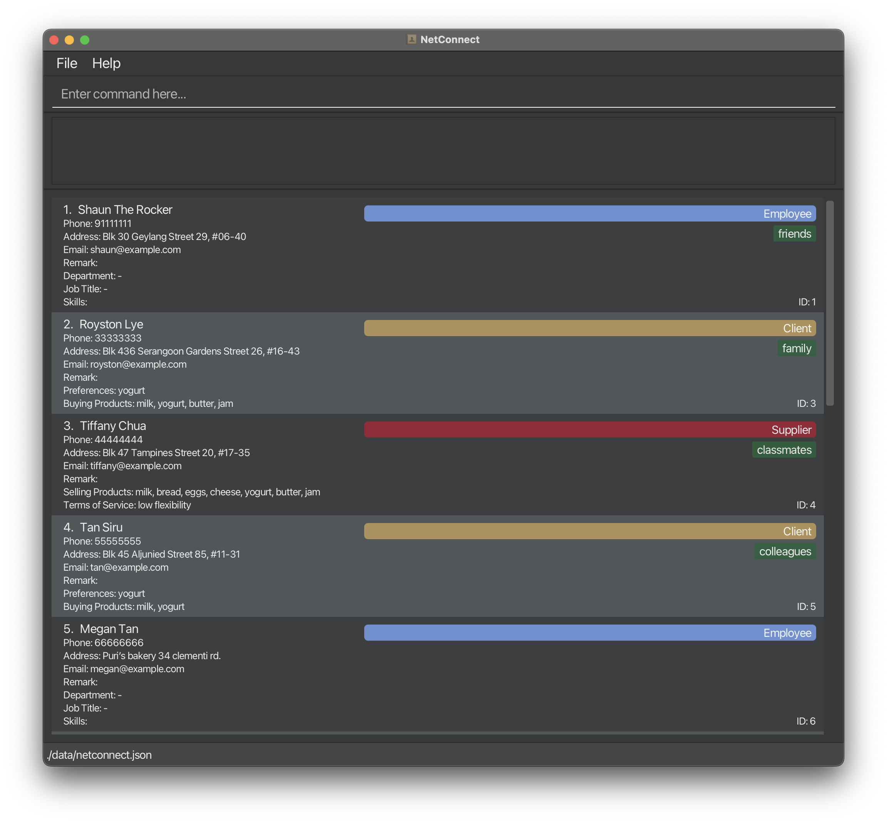

# NetConnect

## Introduction

**NetConnect** is an advanced desktop application for Small to Medium-sized Enterprises (SMEs), designed to streamline the management of contacts via a Command Line Interface (CLI) without sacrificing the intuitiveness of a Graphical User Interface (GUI). It enables comprehensive management of employees, clients, and suppliers' contacts, ensuring all are easily accessible in one centralized location.

## Core Features

NetConnect comes packed with a variety of features tailored for efficient contact management:

* **Profile Management:**
  * Create, delete, and edit profiles with custom tags for employees, clients, and suppliers.
  * Import and export contact data in various formats for easy data management.

* **Category Management:**
  * Organize contacts into distinct categories (e.g., Employees, Clients, Suppliers) for streamlined access and management.

* **Advanced Search and Filtering:**
  * Search for profiles using names, contact numbers, or custom tags.
  * Apply filters to refine search results based on specific criteria.

* **Data Visualization:**
  * Generate csv report of data to assess contact management metrics.

## User-Friendly CLI

Designed with simplicity in mind, NetConnect's CLI commands are intuitive, making contact management accessible to users of all technical levels.

## Robust Error Handling

The application provides clear error messages and solutions, facilitating a seamless management experience.

## Getting Started

Begin managing your contacts with NetConnect:
1. Download the application from the [Releases](https://github.com/AY2324S2-CS2103T-F12-1/tp/releases) page.
2. Refer to the [User Guide](https://github.com/AY2324S2-CS2103T-F12-1/tp/blob/master/docs/UserGuide.md) for detailed instructions on using the application.

## Documentation & Community

* **Full Documentation:** Visit the [NetConnect Website](https://ay2324s2-cs2103t-f12-1.github.io/tp/) for an in-depth look at features, setup, and more.
* **Contributing:** NetConnect is a part of the se-education.org initiative. We welcome contributions! See [how to contribute](https://se-education.org#https://se-education.org/#contributing).

## License

NetConnect is released under the [MIT License](LICENSE).

## Acknowledgements

* This project is a part of the [NUS Software Engineering course](https://nus-cs2103-ay2324s2.github.io/website/).
* Thanks to the SE-EDU initiative for support and guidance.
